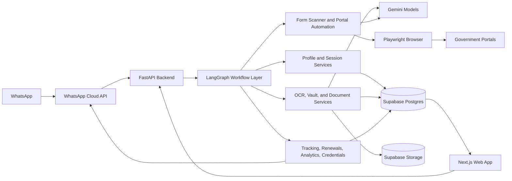
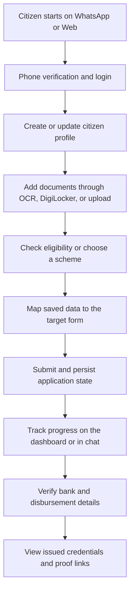

# GovBot

WhatsApp-first government service automation for India.

GovBot brings citizen onboarding, document handling, eligibility checks, form filling, tracking, and officer-side monitoring into one flow. The repo combines a FastAPI backend, a Next.js web app, LangGraph-driven workflow orchestration, Gemini-powered extraction and mapping, and Supabase-backed state.

> One citizen profile. One secured document vault. Multiple public-service workflows from the same guided surface.

[](https://fastapi.tiangolo.com/)
[](https://nextjs.org/)
[](https://langchain-ai.github.io/langgraph/)
[](https://deepmind.google/technologies/gemini/)
[](https://supabase.com/)
[](https://playwright.dev/)

### Live Demo

https://govbot-fawn.vercel.app


## Demo Story

GovBot is designed like a relay across channels instead of a single portal:

- WhatsApp handles discovery, reminders, OTP entry, and lightweight citizen guidance.
- The web app handles profile completion, document review, form submission, live status, and proof sharing.
- Backend agents handle OCR, renewal intelligence, portal mapping, bank verification, and operational visibility.

That makes the project useful both as a citizen-facing assistant and as a hackathon/demo system you can actually walk people through end to end.

## Why GovBot Exists

Most public-service workflows still fall apart in the same places:

- Citizens have to repeat the same personal details across multiple portals.
- Scheme rules are hard to understand without guidance.
- Document handling is clumsy, especially on mobile.
- Status tracking usually disappears once a form is submitted.
- Officers and admins end up with fragmented operational visibility.

GovBot treats WhatsApp as the front door, then uses a web dashboard and backend services to carry the workflow the rest of the way.

## What Makes This Build Stand Out

- A single services hub connects scholarships, PM-KISAN, DigiLocker sync, document workflows, tracking, and admin analytics.
- Renewal reminders combine scholarship due dates with saved document expiry dates, then format them for both web and WhatsApp summaries.
- The bank verification flow is demo-ready and simulates NPCI-style payout verification while masking stored account details.
- Credential and QR verification pages keep a trust layer after submission instead of ending the journey at "application received".

## What The Project Covers

### Citizen-side

- WhatsApp-based entry point for scheme help, tracking, and assisted flows
- OTP login with JWT-backed web access
- Reusable citizen profile with completeness scoring
- Aadhaar OCR and profile prefill
- Document vault for PAN, Aadhaar, income certificates, caste certificates, and marksheets
- 4-digit passkey gate for sensitive documents
- DigiLocker-based document sync flow
- Eligibility screening and scheme guidance
- Auto-fill for portal forms using saved profile data
- Real-time application status timeline and dashboard
- Verifiable credential wallet and QR-based verification pages

### Officer-side

- Overview dashboard for applications and activity
- Disbursement tracking
- Fraud flag views
- Regional performance views

## System Overview


```mermaid
flowchart LR
    WA[WhatsApp] --> WAPI[WhatsApp Cloud API]
    WEB[Next.js Web App] --> API[FastAPI Backend]
    WAPI --> API

    API --> FLOW[LangGraph Workflow Layer]
    FLOW --> PROFILE[Profile and Session Services]
    FLOW --> DOCS[OCR, Vault, and Document Services]
    FLOW --> FORMS[Form Scanner and Portal Automation]
    FLOW --> OPS[Tracking, Renewals, Analytics, Credentials]

    DOCS --> GEMINI[Gemini Models]
    FORMS --> GEMINI
    FORMS --> PLAYWRIGHT[Playwright Browser]
    PLAYWRIGHT --> PORTALS[Government Portals]

    PROFILE --> DB[(Supabase Postgres)]
    DOCS --> DB
    DOCS --> STORAGE[(Supabase Storage)]
    OPS --> DB

    DB --> WEB
    OPS --> WAPI
```

## Core Journey


```mermaid
flowchart TD
    A[Citizen starts on WhatsApp or Web] --> B[Phone verification and login]
    B --> C[Create or update citizen profile]
    C --> D[Add documents through OCR, DigiLocker, or upload]
    D --> E[Check eligibility or choose a scheme]
    E --> F[Map saved data to the target form]
    F --> G[Submit and persist application state]
    G --> H[Track progress on the dashboard or in chat]
    H --> I[Verify bank and disbursement details]
    I --> J[View issued credentials and proof links]
```

## Main Capabilities

| Area                   | What is in the repo                                                                                                     |
| ---------------------- | ----------------------------------------------------------------------------------------------------------------------- |
| Authentication         | WhatsApp OTP flow for citizens, shared officials username/password login, JWT sessions, QR login handoff to the web app |
| Citizen profile        | Persistent profile storage, completeness scoring, profile sync from OCR and document vault data                         |
| Documents              | OCR extraction, validation, vault storage, signed access links, audit logging, passkey protection                       |
| Form automation        | URL-based field analysis, Gemini field mapping, Playwright-backed form filling                                          |
| Schemes and tracking   | Eligibility screeners, PM-KISAN flow, application timelines, live dashboard updates                                     |
| Renewals and reminders | Renewal registration, deadline summaries, document-expiry reminders, WhatsApp-friendly reminder text                    |
| Bank verification      | Demo NPCI/Sandbox-style account verification flow with hashed account storage and payout-readiness checks               |
| Operations             | Admin analytics, fraud views, disbursement and regional dashboards                                                      |
| Credentials            | Wallet pages, issuance endpoints, verification pages, blockchain/IPFS integration hooks                                 |

## Demo-Ready Flows

### 1. Citizen intake to dashboard

Start on WhatsApp, verify by OTP, and hand the citizen off to the web app with a reusable profile and saved session.

### 2. Documents to form-fill

Import or upload documents, extract data through OCR or DigiLocker, then reuse the saved profile to prefill service forms.

### 3. Submission to proof

Track an application through search and dashboard views, then expose verification pages and wallet-style proof once the flow is complete.

### 4. Reminders to payout readiness

Show upcoming renewal deadlines, expiring citizen documents, and bank-account verification from one service surface instead of scattered tools.

## Tech Stack

| Layer                  | Technology                                               |
| ---------------------- | -------------------------------------------------------- |
| Backend API            | FastAPI, Pydantic, Uvicorn                               |
| Workflow orchestration | LangGraph                                                |
| AI services            | Google Gemini                                            |
| Web frontend           | Next.js 16, React 19, TypeScript, Tailwind CSS 4         |
| Data and storage       | Supabase Postgres, Supabase Storage                      |
| Automation             | Playwright                                               |
| Messaging              | WhatsApp Cloud API, Twilio fallback for SMS OTP delivery |
| Live updates           | Supabase realtime and SSE endpoints                      |
| Credentials            | Solidity contract, Polygon/IPFS integration hooks        |

## Repository Map

```text
GovBot/
├── gov_agent/          FastAPI app, routers, workflow logic, vault, OCR, automation agents
├── gov_agent/docs/     Demo assets and reference materials used in the showcase flow
├── frontend/           Next.js pages, dashboards, components, API relay routes
├── frontend/lib/       Shared frontend helpers, content maps, and lightweight tests
├── tests/              Backend tests and realtime utility coverage
├── contracts/          Credential contract source
├── schema.sql          Database schema for Supabase
├── requirements.txt    Python dependencies
├── Dockerfile          Container build
└── README.md
```

Contributor workflow, verification, and shared agent-tooling setup now live in [`CONTRIBUTING.md`](CONTRIBUTING.md) and [`AGENTS.md`](AGENTS.md).

## Local Setup

### Prerequisites

- Python 3.10+
- Node.js 20+
- npm
- Chromium for Playwright
- A Supabase project
- WhatsApp Cloud API credentials if you want the full messaging flow

### 1. Clone the repo

```bash
git clone https://github.com/shashank03-dev/GovBot.git
cd GovBot
```

### 2. Add environment files

Copy the tracked templates:

```bash
cp .env.example .env
cp frontend/.env.local.example frontend/.env.local
```

### Backend environment variables

#### Required core variables

| Variable                   | Purpose                         |
| -------------------------- | ------------------------------- |
| `WHATSAPP_TOKEN`           | WhatsApp Cloud API access token |
| `WHATSAPP_PHONE_NUMBER_ID` | WhatsApp phone number ID        |
| `WHATSAPP_VERIFY_TOKEN`    | Webhook verification token      |
| `SUPABASE_URL`             | Supabase project URL            |
| `SUPABASE_KEY`             | Supabase service-role key       |
| `GEMINI_API_KEY`           | Gemini API key                  |
| `SECRET_KEY`               | JWT signing key                 |

#### Recommended application variables

| Variable                         | Purpose                                                                               |
| -------------------------------- | ------------------------------------------------------------------------------------- |
| `GEMINI_GENERATION_MODELS`       | Optional comma-separated Gemini generation fallback order, default `gemini-2.5-flash,gemini-2.0-flash` |
| `TEXT_LLM_PROVIDERS_JSON`        | Optional test-only text/chat pool configuration for Groq, Gemini, and Mistral routing |
| `WHATSAPP_OTP_TEMPLATE_NAME`     | Approved WhatsApp template for OTP delivery                                           |
| `WHATSAPP_OTP_TEMPLATE_LANGUAGE` | Template language code, default `en_US`                                               |
| `FRONTEND_URL`                   | Public frontend URL used for redirects and profile links                              |
| `BASE_URL`                       | Public backend or base application URL used in generated links                        |
| `CORS_ORIGINS`                   | Comma-separated list of allowed frontend origins                                      |
| `SUPABASE_DOCUMENTS_BUCKET`      | Storage bucket for uploaded documents                                                 |
| `TWILIO_ACCOUNT_SID`             | Twilio account SID for SMS fallback                                                   |
| `TWILIO_AUTH_TOKEN`              | Twilio auth token                                                                     |
| `TWILIO_FROM_NUMBER`             | Twilio sender number                                                                  |

#### Test-only text provider pool

`TEXT_LLM_PROVIDERS_JSON` is used only for the shared text/chat router. It does not change OCR, document/image analysis, or embedding paths, which still use their existing provider-specific code. For free-tier development, prefer Groq first, then Mistral, then Gemini so Gemini quota is saved for image OCR.

Example:

```env
TEXT_LLM_PROVIDERS_JSON=[{"name":"groq-1","provider":"groq","model":"llama-3.1-8b-instant","api_key_env":"GROQ_API_KEY_1","enabled":true,"weight":3},{"name":"mistral-1","provider":"mistral","model":"mistral-small-latest","api_key_env":"MISTRAL_API_KEY_1","enabled":true,"weight":2},{"name":"gemini-1","provider":"gemini","model":"gemini-2.5-flash","api_key_env":"GEMINI_API_KEY","enabled":true,"weight":1}]
GROQ_API_KEY_1=your_groq_key
MISTRAL_API_KEY_1=your_mistral_key
GEMINI_API_KEY=your_gemini_key
```

The router is tuned for testing rather than guaranteed production capacity:

- it prefers the lowest-latency healthy provider
- it does one fast failover for interactive requests
- it uses a small exact-match in-memory cache to absorb repeated test prompts

#### Optional integration variables

| Variable               | Purpose                                    |
| ---------------------- | ------------------------------------------ |
| `SETU_CLIENT_ID`       | DigiLocker provider client ID              |
| `SETU_CLIENT_SECRET`   | DigiLocker provider client secret          |
| `SETU_API_KEY`         | DigiLocker provider API key                |
| `SETU_PRODUCT_ID`      | DigiLocker provider product ID             |
| `SANDBOX_API_KEY`      | Bank verification provider API key         |
| `SANDBOX_API_SECRET`   | Bank verification provider API secret      |
| `SANDBOX_ACCESS_TOKEN` | Bank verification provider access token    |
| `ALCHEMY_API_KEY`      | Blockchain RPC provider key                |
| `POLYGON_PRIVATE_KEY`  | Wallet private key for credential issuance |
| `POLYGON_RPC_URL`      | Polygon RPC URL                            |
| `CONTRACT_ADDRESS`     | Deployed credential contract address       |
| `PINATA_API_KEY`       | Pinata API key                             |
| `PINATA_SECRET_KEY`    | Pinata secret key                          |

Official dashboards require a separate shared credential:

```bash
OFFICIAL_USERNAME=shared-official-username(add it yourself)
OFFICIAL_PASSWORD=shared-official-password(add it yourself)
```

### Frontend environment variables

| Variable                   | Purpose                                             |
| -------------------------- | --------------------------------------------------- |
| `NEXT_PUBLIC_API_URL`      | Backend base URL                                    |
| `NEXT_PUBLIC_SUPABASE_URL` | Supabase project URL                                |
| `NEXT_PUBLIC_SUPABASE_KEY` | Supabase client-side key used by the frontend pages |

### 3. Install project dependencies

```bash
make setup
```

### 4. Run explicit backend bootstrap

This is intentionally separate from app startup. Use it when you create a fresh workspace or need to rebuild local RAG state.

```bash
make bootstrap
```

### 5. Start the backend

```bash
make dev-backend
```

### 6. Start the frontend

```bash
make dev-frontend
```

You can also run both together:

```bash
make dev
```

If those ports are already in use, override them explicitly:

```bash
make dev BACKEND_PORT=8001 FRONTEND_PORT=3001
```

### 7. Expose the backend for webhook testing if needed

```bash
ngrok http 8000
```

## Useful Development Checks

```bash
make test-backend
make test-frontend
make lint
make typecheck
make build
make check
```

## Demo Routes Worth Showing

| Route                        | Why it matters                                                         |
| ---------------------------- | ---------------------------------------------------------------------- |
| `/`                          | Landing page with cross-channel positioning and service discovery      |
| `/services`                  | Central hub for scholarships, tools, and official dashboards           |
| `/official-login`            | Shared government-official sign-in before analytics or admin access    |
| `/documents`                 | Passkey-protected vault for PAN, Aadhaar, certificates, and marksheets |
| `/form-fill`                 | Generic form auto-fill surface driven by saved citizen data            |
| `/renewals`                  | Combined document expiry and scholarship reminder experience           |
| `/bank-verify`               | Demo-ready payout verification flow                                    |
| `/track-search`              | Confirmation-based application search and tracking entry point         |
| `/gov-dashboard`             | Officer-side analytics, disbursement, and fraud visibility             |
| `/wallet` and `/verify/[id]` | Credential display and QR-style proof verification                     |

## Notable Backend Areas

- [`gov_agent/main.py`](gov_agent/main.py) wires the FastAPI app and router surface.
- [`gov_agent/flow_router.py`](gov_agent/flow_router.py) handles the WhatsApp conversation flow, passkey commands, and dashboard link generation.
- [`gov_agent/profile_router.py`](gov_agent/profile_router.py) manages persistent citizen profiles and completeness tracking.
- [`gov_agent/document_vault.py`](gov_agent/document_vault.py) contains document ingestion, storage, masking, and signed-link logic.
- [`gov_agent/form_scanner_router.py`](gov_agent/form_scanner_router.py) covers field extraction, Gemini mapping, and form auto-fill execution.
- [`gov_agent/renewal_intelligence.py`](gov_agent/renewal_intelligence.py) builds reminder summaries from document expiries and renewal dates.
- [`gov_agent/npci_router.py`](gov_agent/npci_router.py) exposes the demo bank-verification flow and payout-readiness helpers.

## Notable Frontend Areas

- [`frontend/pages/dashboard.tsx`](frontend/pages/dashboard.tsx) is the main citizen dashboard with realtime activity.
- [`frontend/pages/profile.tsx`](frontend/pages/profile.tsx) is the profile editor and completeness view.
- [`frontend/pages/documents.tsx`](frontend/pages/documents.tsx) is the document vault UI.
- [`frontend/pages/form-fill.tsx`](frontend/pages/form-fill.tsx) is the generic form auto-fill surface.
- [`frontend/pages/services.tsx`](frontend/pages/services.tsx) acts as the cross-service navigation layer for citizens and officials.
- [`frontend/pages/official-login.tsx`](frontend/pages/official-login.tsx) handles the shared official username/password sign-in flow.
- [`frontend/pages/renewals.tsx`](frontend/pages/renewals.tsx) shows renewal reminders and document expiry summaries.
- [`frontend/pages/bank-verify.tsx`](frontend/pages/bank-verify.tsx) presents the guided bank verification flow.
- [`frontend/pages/gov-dashboard/index.tsx`](frontend/pages/gov-dashboard/index.tsx) starts the officer dashboard flow.

## Contributing

Use [`CONTRIBUTING.md`](CONTRIBUTING.md) for the canonical workflow and [`AGENTS.md`](AGENTS.md) for shared agent-tooling guidance.

## License

This project is licensed under the MIT License.

Copyright (c) 2026 Shashank Gowda.
