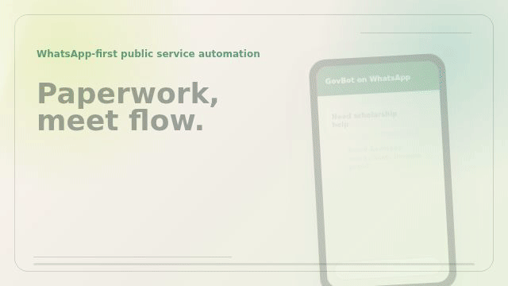
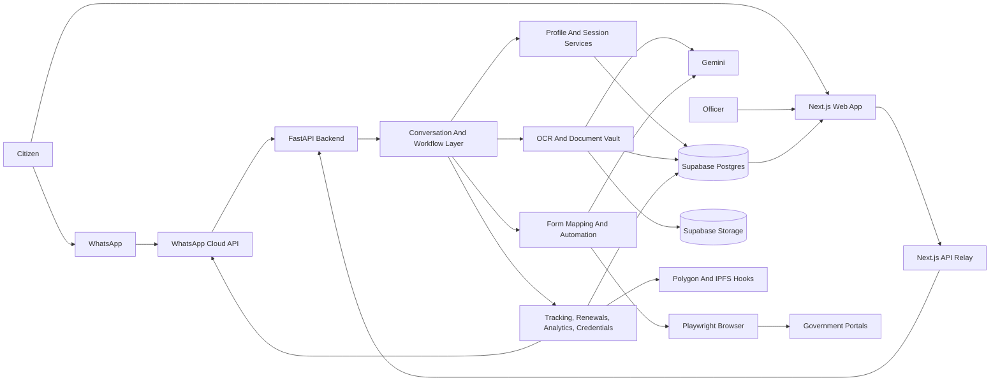
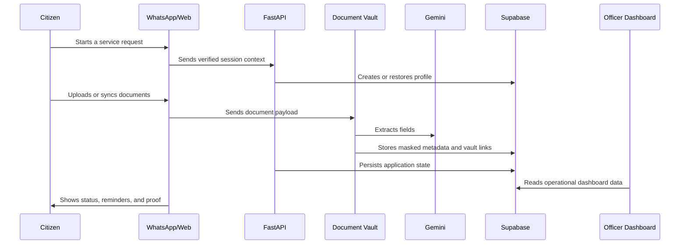

# GovBot

<p align="center">
  <strong>Government services, from paper trail to proof trail.</strong>
</p>

<p align="center">
  GovBot is a WhatsApp-first public-service assistant for India. It helps citizens onboard once, store documents once, check schemes, fill forms, track applications, verify payouts, and carry proof forward.
</p>

<p align="center">
  <a href="https://govbot-fawn.vercel.app"><strong>Live Demo</strong></a>
  ·
  <a href="#quick-start"><strong>Quick Start</strong></a>
  ·
  <a href="#demo-routes"><strong>Demo Routes</strong></a>
  ·
  <a href="#read-the-system"><strong>Read The System</strong></a>
</p>

<p align="center">
  <a href="https://fastapi.tiangolo.com/"></a>
  <a href="https://nextjs.org/"></a>
  <a href="https://react.dev/"></a>
  <a href="https://www.remotion.dev/"></a>
  <a href="https://supabase.com/"></a>
  <a href="https://playwright.dev/"></a>
</p>



<p align="center">
  <a href="gov_agent/docs/govbot-showcase.mp4">Watch the 12 second MP4</a>
  ·
  <a href="gov_agent/docs/demo1.gif">Open the original product GIF</a>
  ·
  <a href="frontend/remotion/GovBotShowcase.tsx">Edit the Remotion source</a>
</p>

## What GovBot Does

GovBot turns the usual public-service runaround into a guided relay:

1. A citizen starts from WhatsApp or the web.
2. Phone verification opens a reusable profile.
3. Documents move into a protected vault.
4. Eligibility and form mapping reuse the saved profile.
5. Applications stay trackable after submission.
6. Officers get dashboards for fraud, disbursement, regions, and activity.
7. Credentials and QR proof keep the trust layer alive after approval.

The word play is intentional: GovBot is not another form queue. It is a queue-cutter, proof-carrier, and status-finder for workflows that usually ask citizens to start over again and again.

## Table Of Contents

- [Why It Exists](#why-it-exists)
- [The Product In One Glance](#the-product-in-one-glance)
- [Demo Routes](#demo-routes)
- [Quick Start](#quick-start)
- [Environment Guide](#environment-guide)
- [Read The System](#read-the-system)
- [Architecture](#architecture)
- [Data And Trust Model](#data-and-trust-model)
- [Remotion Video](#remotion-video)
- [Verification](#verification)
- [Contributing](#contributing)

## Why It Exists

Public-service workflows often break in boring places:

| The usual pain | GovBot's answer |
| --- | --- |
| Citizens type the same details on every portal | One reusable profile follows the journey |
| Documents are scattered across chats, files, and portals | A passkey-protected vault keeps them close |
| Scheme rules feel like a maze | Guided eligibility turns the maze into a map |
| Application status disappears after submission | Search, dashboard, and WhatsApp updates keep it visible |
| Officers see fragments, not flow | Analytics, fraud flags, and disbursement views share one surface |
| Proof ends at "application received" | Wallet and QR verification pages carry proof forward |

## The Product In One Glance

<details open>
<summary><strong>Citizen Journey</strong></summary>

| Step | Surface | What happens |
| --- | --- | --- |
| Discover | WhatsApp or `/services` | Citizen asks for help, chooses a service, or opens the web app |
| Verify | OTP login | Phone-backed session creates or restores access |
| Profile | `/profile` and dashboard | Saved details become the citizen's reusable service passport |
| Documents | `/documents`, OCR, DigiLocker | Aadhaar, PAN, income certificates, caste certificates, and marksheets move into the vault |
| Decide | `/eligibility`, scholarship routes, PM-KISAN | Scheme checks turn requirements into next steps |
| Fill | `/form-fill`, NSP/SSP flows | Saved profile and document data map into forms |
| Track | `/track-search`, `/track/[id]`, dashboard | Application state remains searchable and visible |
| Prove | `/wallet`, `/verify/[id]` | Credentials and QR-style proof close the loop |

</details>

<details>
<summary><strong>Officer Journey</strong></summary>

| View | Route | Purpose |
| --- | --- | --- |
| Official login | `/official-login` | Shared username/password gate for demo official tools |
| Overview | `/gov-dashboard` | Operational picture for applications and activity |
| Disbursements | `/gov-dashboard/disbursements` | Payout and release visibility |
| Fraud | `/gov-dashboard/fraud` | Suspicious application and document signals |
| Regions | `/gov-dashboard/regional` | Regional activity and service performance |
| Admin | `/admin` | Admin-oriented monitoring surface |

</details>

<details>
<summary><strong>AI And Automation Layer</strong></summary>

| Capability | How the repo handles it |
| --- | --- |
| Conversation flow | FastAPI routers plus LangGraph-style orchestration |
| OCR and extraction | Gemini-backed document parsing, with provider-specific clients |
| Text routing | Optional Groq, Mistral, and Gemini pool for test-time text/chat routing |
| Form mapping | Gemini-assisted field mapping for target forms |
| Browser automation | Playwright-assisted form fill execution |
| Reminders | Renewal intelligence combines scholarship dates and document expiry |
| Verification | Credential wallet, QR proof pages, and blockchain/IPFS integration hooks |

</details>

## Demo Routes

These are the routes worth walking in a demo. Start with `/services` if you want the cleanest product tour.

| Route | Why it matters |
| --- | --- |
| `/` | Landing page and cross-channel positioning |
| `/services` | Central hub for citizen services and official tools |
| `/login` | Citizen OTP entry |
| `/dashboard` | Citizen timeline, profile state, and activity |
| `/profile` | Profile editor and completeness view |
| `/documents` | Passkey-protected document vault |
| `/ocr` | OCR extraction surface |
| `/digilocker` | DigiLocker sync entry point |
| `/eligibility` | Scheme screening |
| `/pmkisan` | PM-KISAN flow |
| `/nsp` and `/nsp/apply` | National Scholarship Portal demo |
| `/ssp` and `/ssp/step-1` through `/ssp/step-5` | SSP guided portal replacement |
| `/form-fill` | Generic saved-data-to-form surface |
| `/renewals` | Scholarship renewal and document-expiry reminders |
| `/bank-verify` | Demo payout-readiness verification |
| `/track-search` | Application lookup |
| `/wallet` and `/verify/[id]` | Credential display and QR proof verification |
| `/official-login` | Official access gate |
| `/gov-dashboard` | Officer overview |
| `/gov-dashboard/disbursements` | Treasury and payout view |
| `/gov-dashboard/fraud` | Fraud flag view |
| `/gov-dashboard/regional` | Regional performance view |
| `/admin` | Admin view |

## Quick Start

The repo has one supported workflow surface: use `make`.

```bash
git clone https://github.com/shashank03-dev/GovBot.git
cd GovBot
cp .env.example .env
cp frontend/.env.local.example frontend/.env.local
make setup
make bootstrap
make dev
```

Local services:

| Service | URL |
| --- | --- |
| Backend | `http://127.0.0.1:8000` |
| Health check | `http://127.0.0.1:8000/govbot/health` |
| Frontend | `http://127.0.0.1:3000` |

Port already busy?

```bash
make dev BACKEND_PORT=8001 FRONTEND_PORT=3001
```

Need only one side?

```bash
make dev-backend
make dev-frontend
```

> Important: FastAPI startup is intentionally non-mutating. If local cleanup or RAG ingestion is needed, run `make bootstrap` explicitly.

## Environment Guide

<details open>
<summary><strong>Core backend variables</strong></summary>

| Variable | Purpose |
| --- | --- |
| `WHATSAPP_TOKEN` | WhatsApp Cloud API access token |
| `WHATSAPP_PHONE_NUMBER_ID` | WhatsApp phone number ID |
| `WHATSAPP_VERIFY_TOKEN` | Webhook verification token |
| `SUPABASE_URL` | Supabase project URL |
| `SUPABASE_KEY` | Supabase service-role key |
| `GEMINI_API_KEY` | Gemini API key |
| `SECRET_KEY` | JWT signing key |

</details>

<details>
<summary><strong>Recommended application variables</strong></summary>

| Variable | Purpose |
| --- | --- |
| `GEMINI_GENERATION_MODELS` | Optional Gemini fallback order, default `gemini-2.5-flash,gemini-2.0-flash` |
| `TEXT_LLM_PROVIDERS_JSON` | Optional test-time text/chat pool for Groq, Gemini, and Mistral |
| `WHATSAPP_OTP_TEMPLATE_NAME` | Approved WhatsApp template for OTP delivery |
| `WHATSAPP_OTP_TEMPLATE_LANGUAGE` | Template language code, default `en_US` |
| `FRONTEND_URL` | Public frontend URL used for redirects and profile links |
| `BASE_URL` | Public backend or app URL used in generated links |
| `CORS_ORIGINS` | Comma-separated allowed frontend origins |
| `SUPABASE_DOCUMENTS_BUCKET` | Storage bucket for uploaded documents |
| `TWILIO_ACCOUNT_SID` | Twilio account SID for SMS fallback |
| `TWILIO_AUTH_TOKEN` | Twilio auth token |
| `TWILIO_FROM_NUMBER` | Twilio sender number |

</details>

<details>
<summary><strong>Optional integration variables</strong></summary>

| Variable | Purpose |
| --- | --- |
| `SETU_CLIENT_ID` | DigiLocker provider client ID |
| `SETU_CLIENT_SECRET` | DigiLocker provider client secret |
| `SETU_API_KEY` | DigiLocker provider API key |
| `SETU_PRODUCT_ID` | DigiLocker provider product ID |
| `SANDBOX_API_KEY` | Bank verification provider API key |
| `SANDBOX_API_SECRET` | Bank verification provider API secret |
| `SANDBOX_ACCESS_TOKEN` | Bank verification provider access token |
| `ALCHEMY_API_KEY` | Blockchain RPC provider key |
| `POLYGON_PRIVATE_KEY` | Wallet private key for credential issuance |
| `POLYGON_RPC_URL` | Polygon RPC URL |
| `CONTRACT_ADDRESS` | Deployed credential contract address |
| `PINATA_API_KEY` | Pinata API key |
| `PINATA_SECRET_KEY` | Pinata secret key |

</details>

<details>
<summary><strong>Frontend variables</strong></summary>

| Variable | Purpose |
| --- | --- |
| `NEXT_PUBLIC_API_URL` | Backend base URL |
| `NEXT_PUBLIC_SUPABASE_URL` | Supabase project URL |
| `NEXT_PUBLIC_SUPABASE_KEY` | Supabase client-side key used by frontend pages |

</details>

<details>
<summary><strong>Official dashboard demo credential</strong></summary>

```bash
OFFICIAL_USERNAME=shared-official-username
OFFICIAL_PASSWORD=shared-official-password
```

</details>

<details>
<summary><strong>Optional text provider pool example</strong></summary>

`TEXT_LLM_PROVIDERS_JSON` only affects the shared text/chat router. OCR, image analysis, and embeddings keep their provider-specific paths.

```env
TEXT_LLM_PROVIDERS_JSON=[{"name":"groq-1","provider":"groq","model":"llama-3.1-8b-instant","api_key_env":"GROQ_API_KEY_1","enabled":true,"weight":3},{"name":"mistral-1","provider":"mistral","model":"mistral-small-latest","api_key_env":"MISTRAL_API_KEY_1","enabled":true,"weight":2},{"name":"gemini-1","provider":"gemini","model":"gemini-2.5-flash","api_key_env":"GEMINI_API_KEY","enabled":true,"weight":1}]
GROQ_API_KEY_1=your_groq_key
MISTRAL_API_KEY_1=your_mistral_key
GEMINI_API_KEY=your_gemini_key
```

The router prefers healthy low-latency providers, does one fast failover for interactive requests, and uses a small exact-match in-memory cache for repeated test prompts.

</details>

## Read The System

```text
GovBot/
├── gov_agent/              FastAPI app, routers, workflow logic, OCR, vault, automation
├── gov_agent/docs/         Demo GIFs, Remotion renders, and reference files
├── frontend/               Next.js pages, components, relay API routes, Remotion source
├── frontend/lib/           Shared frontend helpers and lightweight Node tests
├── frontend/remotion/      Code-generated video composition for this README
├── tests/                  Backend tests and realtime utility coverage
├── contracts/              Credential contract source
├── api/                    Deployment adapter entrypoint
├── schema.sql              Supabase schema
├── requirements.txt        Python dependencies
├── Dockerfile              Container build
├── Makefile                Supported workflow commands
├── CONTRIBUTING.md         Canonical contributor workflow
└── AGENTS.md               Shared agent-tooling guidance
```

<details open>
<summary><strong>Backend files to know</strong></summary>

| File | Role |
| --- | --- |
| `gov_agent/main.py` | FastAPI app and router registration |
| `gov_agent/flow_router.py` | WhatsApp conversation flow, passkey commands, dashboard links |
| `gov_agent/profile_router.py` | Citizen profile storage and completeness tracking |
| `gov_agent/document_vault.py` | Document ingestion, storage, masking, signed links, audit logic |
| `gov_agent/form_scanner_router.py` | Field extraction, Gemini mapping, form auto-fill execution |
| `gov_agent/renewal_intelligence.py` | Renewal and document-expiry summaries |
| `gov_agent/npci_router.py` | Demo bank verification and payout-readiness helpers |
| `gov_agent/credentials_router.py` | Credential issuance and verification endpoints |
| `gov_agent/treasury_router.py` | Treasury and disbursement release flow |
| `gov_agent/whatsapp_bridge_router.py` | WhatsApp bridge helpers for demo operations |

</details>

<details>
<summary><strong>Frontend files to know</strong></summary>

| File | Role |
| --- | --- |
| `frontend/pages/index.tsx` | Landing page |
| `frontend/pages/services.tsx` | Service navigation hub |
| `frontend/pages/dashboard.tsx` | Citizen dashboard and realtime activity |
| `frontend/pages/profile.tsx` | Profile editor and completeness view |
| `frontend/pages/documents.tsx` | Document vault UI |
| `frontend/pages/form-fill.tsx` | Generic form auto-fill surface |
| `frontend/pages/renewals.tsx` | Renewal reminders and document expiry summaries |
| `frontend/pages/bank-verify.tsx` | Guided bank verification |
| `frontend/pages/gov-dashboard/index.tsx` | Officer dashboard overview |
| `frontend/pages/api/[...path].ts` | Frontend API relay to the backend |
| `frontend/remotion/GovBotShowcase.tsx` | README video composition |

</details>

## Architecture


```mermaid
flowchart LR
    Citizen[Citizen] --> WhatsApp[WhatsApp]
    Citizen --> Web[Next.js Web App]
    Officer[Officer] --> Web

    WhatsApp --> Cloud[WhatsApp Cloud API]
    Cloud --> API[FastAPI Backend]
    Web --> Relay[Next.js API Relay]
    Relay --> API

    API --> Flow[Conversation And Workflow Layer]
    Flow --> Profile[Profile And Session Services]
    Flow --> Vault[OCR And Document Vault]
    Flow --> Forms[Form Mapping And Automation]
    Flow --> Ops[Tracking, Renewals, Analytics, Credentials]

    Vault --> Gemini[Gemini]
    Forms --> Gemini
    Forms --> Browser[Playwright Browser]
    Browser --> Portals[Government Portals]

    Profile --> DB[(Supabase Postgres)]
    Vault --> DB
    Vault --> Storage[(Supabase Storage)]
    Ops --> DB
    Ops --> Chain[Polygon And IPFS Hooks]

    DB --> Web
    Ops --> Cloud
```


```mermaid
sequenceDiagram
    participant C as Citizen
    participant W as WhatsApp/Web
    participant A as FastAPI
    participant V as Document Vault
    participant G as Gemini
    participant S as Supabase
    participant O as Officer Dashboard

    C->>W: Starts a service request
    W->>A: Sends verified session context
    A->>S: Creates or restores profile
    C->>W: Uploads or syncs documents
    W->>V: Sends document payload
    V->>G: Extracts fields
    V->>S: Stores masked metadata and vault links
    A->>S: Persists application state
    O->>S: Reads operational dashboard data
    W->>C: Shows status, reminders, and proof
```

## Data And Trust Model

| Area | Approach |
| --- | --- |
| Sessions | OTP-backed citizen sessions and shared official auth for demo dashboards |
| Documents | Vault storage, masking, signed access links, audit logs, passkey protection |
| Profile reuse | OCR and vault data can prefill profile and form targets |
| Realtime | Supabase realtime and server-sent event endpoints support live dashboard updates |
| Payout readiness | Demo bank verification stores masked or hashed account details |
| Credentials | Wallet and verification pages connect to blockchain/IPFS integration hooks |
| Startup safety | Mutating cleanup and RAG ingestion stay out of FastAPI startup |

## Remotion Video

The animated README reel is code, not a hand-edited export.

| Command | What it does |
| --- | --- |
| `npm run video` | Opens Remotion Studio from `frontend/remotion/index.ts` |
| `npm run video:render` | Renders `gov_agent/docs/govbot-showcase.mp4` |
| `npm run video:gif` | Renders the README-friendly `gov_agent/docs/govbot-showcase.gif` |

Run these from `frontend/`:

```bash
npm run video
npm run video:render
npm run video:gif
```

The current render is 12 seconds long. The MP4 is 1280x720 at 30 FPS. The GIF is 640x360 at 10 FPS so it stays reasonable for GitHub.

## Verification

Use the narrow target first, then the full repo gate before claiming the repo is healthy.

```bash
make test-backend
make test-frontend
make lint
make typecheck
make build
make check
```

For workflow or frontend changes, also run the app and verify the main demo routes in a browser:

```bash
make dev
```

Then walk:

```text
/
/services
/official-login
/documents
/form-fill
/renewals
/bank-verify
/track-search
/gov-dashboard
/admin
```

## Deployment Notes

The frontend is linked to the `govbot` Vercel project through `frontend/.vercel/project.json`.

For a Vercel frontend plus public backend tunnel demo, set:

| Location | Variables |
| --- | --- |
| Vercel frontend project | `BACKEND_URL`, `NEXT_PUBLIC_API_URL`, `NEXT_PUBLIC_FRONTEND_URL`, `NEXT_PUBLIC_SUPABASE_URL`, `NEXT_PUBLIC_SUPABASE_KEY` |
| Backend `.env` | `FRONTEND_URL`, `BASE_URL`, `CORS_ORIGINS` |

Keep browser-visible calls on the frontend origin by using `/api/*` proxy routes instead of hard-coding the backend host in pages or components.

## Contributing

Use the repo workflow layer:

```bash
make setup
make bootstrap
make check
```

Read [`CONTRIBUTING.md`](CONTRIBUTING.md) for the canonical workflow and [`AGENTS.md`](AGENTS.md) for shared agent-tooling expectations.

Do not commit local secrets, `.next`, `node_modules`, `chroma_db`, personal IDE state, or generated one-off screenshots.

## License

MIT License.

Copyright (c) 2026 Shashank Gowda.
